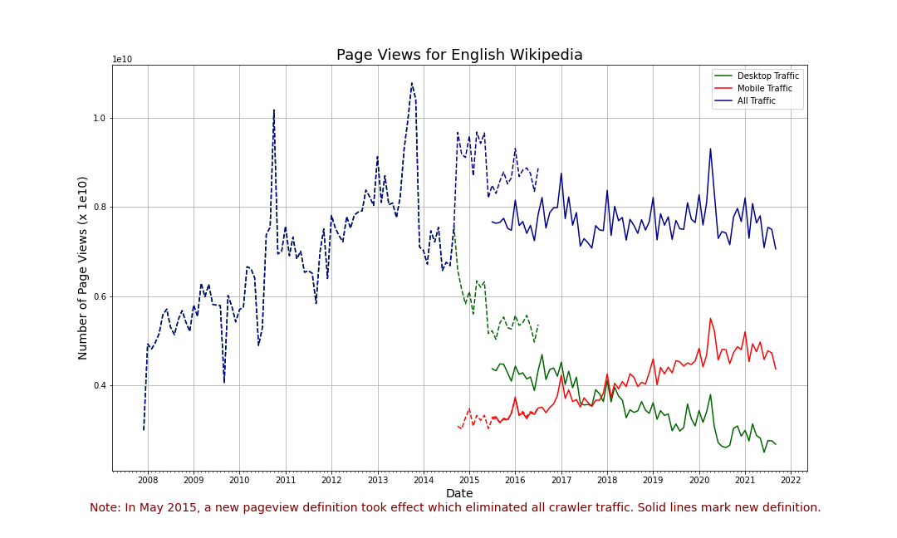

# DATA512 Assignment A1

### Introduction

The goal of this assignment is to construct, analyze, and publish a dataset of monthly traffic on English Wikipedia from January 1, 2008 through September 30, 2021. All analysis is performed in a single Jupyter notebook; the Jupyter notebook and data files are uploaded in this GitHub repository.

The purpose of the assignment is to demonstrate best practices for open scientific research. The project should be fully reproducible by others: from data collection to data analysis.

To demostrate these skills, we will combine data about Wikipedia page traffic from two different Wikimedia REST API endpoints into a single dataset, perform some simple data processing steps on the data, and then analyze that data.

### Data Source

Data is collected from two different Wikimedia REST API.

- The Legacy Pagecounts API ([documentation](https://wikitech.wikimedia.org/wiki/Analytics/AQS/Legacy_Pagecounts), [endpoint](https://wikimedia.org/api/rest_v1/#!/Pagecounts_data_(legacy)/get_metrics_legacy_pagecounts_aggregate_project_access_site_granularity_start_end)) provides access to desktop and mobile traffic data from December 2007 through July 2016.
- The Pageviews API ([documentation](https://wikitech.wikimedia.org/wiki/Analytics/AQS/Pageviews), [endpoint](https://wikimedia.org/api/rest_v1/#!/Pageviews_data/get_metrics_pageviews_aggregate_project_access_agent_granularity_start_end)) provides access to desktop, mobile web, and mobile app traffic data from July 2015 through last month.

The terms and conditions of the API can be viewed [here](https://www.mediawiki.org/wiki/Wikimedia_REST_API).

### Dataset

The JSON-formatted data source files are processed using the following steps:
- Combined into a single pandas dataframe
- Pivoted on Source so each row contains the view counts for each access method for one month
- Combine the mobile app and mobile web access methods to a single column and calculate total views for pagecount and pageview

After processing, the dataset hsa the following format:
| Column                  | Value     |
|-------------------------|-----------|
| year                    | YYYY      |
| month                   | MM        |
| pagecount_all_views     | num_views |
| pagecount_desktop_views | num_views |
| pagecount_mobile_views  | num_views |
| pageview_all_views      | num_views |
| pageview_desktop_views  | num_views |
| pageview_mobile_views   | num_views |

### Considerations

The methodology for counting page views changed in May 2015. Prior to that date, the legacy pagecounts reported user traffic and crawler traffic together. The updated method separates user traffic from automated traffic providing researchers to have a clearer understanding of the data. More information about the legacy pagecounts can be found [here](https://wikitech.wikimedia.org/wiki/Analytics/AQS/Legacy_Pagecounts). 

The legacy counts (including crawlers) are represented with the dotted lines on the visualization while the user-only traffic is represented with the solid line.

### Repository Structure
```
├── LICENSE
├── README.md
├── data
│   ├── processed
│   │   └── en-wikipedia_traffic_200712-202109.csv
│   ├── raw
│   │   ├── pagecounts_desktop-site_2007120100-2016080100.json
│   │   ├── pagecounts_mobile-site_2007120100-2016080100.json
│   │   ├── pageviews_desktop_2015070100-2021100100.json
│   │   ├── pageviews_mobile-app_2015070100-2021100100.json
│   │   └── pageviews_mobile-web_2015070100-2021100100.json
│   └── visualization
│       └── en-wikipedia_traffic_200712-202109.png
└── src
    └── hcds-a1-data-curation.ipynb
```

### Visualization




